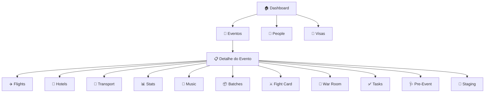

# 🏟️ UAEW App — Guia Completo

Bem-vindo ao guia do **UAEW App** — o sistema de gerenciamento de eventos de MMA da UAE Warriors. Este vault documenta cada página, fluxo e funcionalidade do aplicativo.

---

## 🗺️ Mapa do Aplicativo

---

## 📑 Páginas do App

### Páginas Globais (sempre acessíveis)
| Página | Descrição |
|--------|-----------|
| [[01 - Dashboard]] | Central de comando, KPIs e visão geral |
| [[02 - Eventos]] | Lista de todos os eventos |
| [[03 - People]] | Cadastro global de pessoas |
| [[04 - Flights]] | Gestão de voos (cross-evento) |
| [[05 - Visas]] | Controle de vistos |

### Páginas de Evento (dentro de cada evento)
| Página | Descrição |
|--------|-----------|
| [[06 - Detalhe do Evento]] | Dashboard + Roster do evento |
| [[07 - Hotels]] | Logística de hospedagem |
| [[08 - Transport]] | Carros, motoristas e passageiros |
| [[09 - Stats]] | Estatísticas, recordes e uniformes |
| [[10 - Music]] | Músicas de entrada dos lutadores |
| [[11 - Batches]] | Lotes organizacionais (pesagem, médico) |
| [[12 - Fight Card]] | Card de lutas oficial |
| [[13 - War Room]] | Centro de comando em tempo real |
| [[14 - Tasks]] | Tarefas operacionais e templates |
| [[15 - Pre-Event]] | Exames, documentos e clearance |
| [[16 - Staging]] | Check pré-partida e monitor público |

---

## 🔄 Fluxo Geral de Trabalho

1. **Cadastrar pessoas** em [[03 - People]] — criação manual ou [[17 - Importação CSV]]
2. **Criar evento** em [[02 - Eventos]]
3. **Enrollar participantes** no [[06 - Detalhe do Evento]] (Roster)
4. **Gerenciar logística**: [[04 - Flights]], [[07 - Hotels]], [[08 - Transport]]
5. **Preparar lutadores**: [[09 - Stats]], [[10 - Music]], [[15 - Pre-Event]]
6. **Organizar operações**: [[11 - Batches]], [[14 - Tasks]]
7. **Publicar card**: [[12 - Fight Card]]
8. **Dia do evento**: [[13 - War Room]], [[16 - Staging]]

---

## 📥 Funcionalidades Transversais

- [[17 - Importação CSV]] — Sistema de importação em massa
- [[18 - Permissões e Roles]] — Controle de acesso por papel
- [[19 - Realtime]] — Sistema de tempo real e presença
